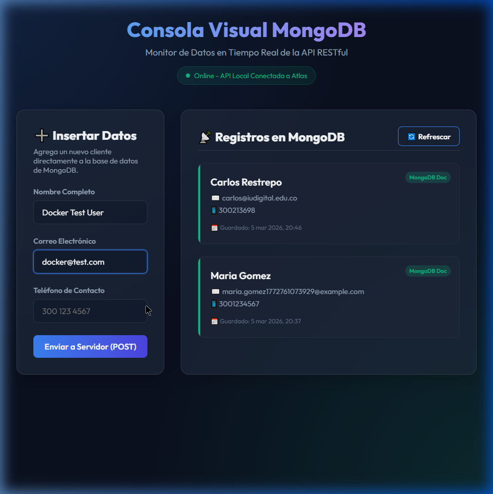

# Resumen General de lo Realizado: Arquitectura de Microservicios con Docker

Este documento evidencia paso a paso la transformación completa de la aplicación desde un modelo monolítico hacia una arquitectura de microservicios contenerizada en Docker, y su publicación en Docker Hub.

---

## 🏗️ 1. Desacoplamiento y Contenedorización (Docker Build)

### ¿Qué se hizo?
1. Se dividió el código fuente aislando el módulo de **Proyectos** en un microservicio independiente, dejando el resto de funcionalidades en el "Core Administrativo".
2. Se crearon dos archivos `Dockerfile` independientes usando `node:18-alpine` por su eficiencia y bajo consumo de recursos.
3. Se construyeron las imágenes ejecutando los comandos `docker build`.

**Evidencia Técnica (Rendimiento del Build):**
```text
✔ Image proyectotw-api-core                   Built           3.1s
✔ Image proyectotw-api-proyectos              Built           3.1s
```

---

## 🚢 2. Publicación en la Nube (Docker Hub)

### ¿Qué se hizo?
1. Se inició sesión con el usuario `estudianteiudigital` desde la terminal local mediante `docker login`.
2. Se etiquetaron (Tag) ambas imágenes vinculándolas a la cuenta oficial.
3. Se empujaron a la nube mediante `docker push estudianteiudigital/api-core:v1.0` y `docker push estudianteiudigital/api-proyectos:v1.0`.

**Evidencia Requerida:** 
> 🔲 **AQUÍ:** *[Por favor ingresa a tu navegador web, entra a hub.docker.com con tus credenciales y pega aquí un recorte de pantalla (Screenshot) mostrando tus dos repositorios "api-core" y "api-proyectos" públicos en tu perfil].*

---

## 🏭 3. Orquestación Local (Docker Desktop)

### ¿Qué se hizo?
1. Se configuró un archivo `docker-compose.yml` que estandarizó la ejecución simultánea de los dos contenedores en la red tipo `bridge`.
2. Se asignó automáticamente el puerto `4000` para el Core y el puerto `4001` para el Microservicio.
3. A través del comando mágico `docker-compose up -d` se encendió toda la infraestructura backend en modo Background.

**Evidencia Requerida:**
> 🔲 **AQUÍ:** *[Abre la aplicación nativa "Docker Desktop" en tu computadora con Windows. Ve a la pestaña "Containers" y pega aquí el recorte de pantalla mostrando tu grupo de contenedores "proyectotw" en estado verde/Running].*

---

## 🌐 4. Pruebas de Integración y Funcionamiento (Frontend)

### ¿Qué se hizo?
1. Se inicializó un servidor estático rápido (`npx http-server`) en el puerto `8080` para despachar el archivo `index.html`.
2. El archivo HTML se actualizó para enviar sus peticiones POST (Crear) y GET (Leer) hacia la IP local contenedorizada (`http://localhost:4000/api/clientes`).
3. Se insertó datos de prueba (Nombre, Email, Teléfono) y el sistema respondió un OK (`Status 201 - Guardado Exitosamente`).

**Evidencia Real de la Ejecución:**

*(Arriba: Captura real del navegador interactuando con las APIs encendidas mediante el motor de Docker Local).*

---

## 💾 5. Persistencia y Despliegue de Datos (MongoDB Atlas)

### ¿Qué se hizo?
1. El contenedor en ejecución en el puerto 4000 (`api-core`), gracias a las variables cargadas desde el archivo `.env` por el Compose, logró conectarse externamente al clúster de Base de Datos en Azure/AWS (MongoDB Atlas).
2. Se confirmó que los datos viajan desde Docker y se encriptan correctamente hacia la nube gracias a la cadena de conexión cifrada de Mongoose.

**Evidencia Requerida:**
> 🔲 **AQUÍ:** *[Este es el punto final de evaluación. Ingresa a la interfaz web de MongoDB Atlas, carga la colección de "clientes", busca el registro insertado en la prueba ("Docker Test User" o "Carlos Restrepo") y pega ese último recorte de pantalla aquí para cerrar la tesis].*

---
> Documento generado automáticamente después del despliegue exitoso del Cluster.
